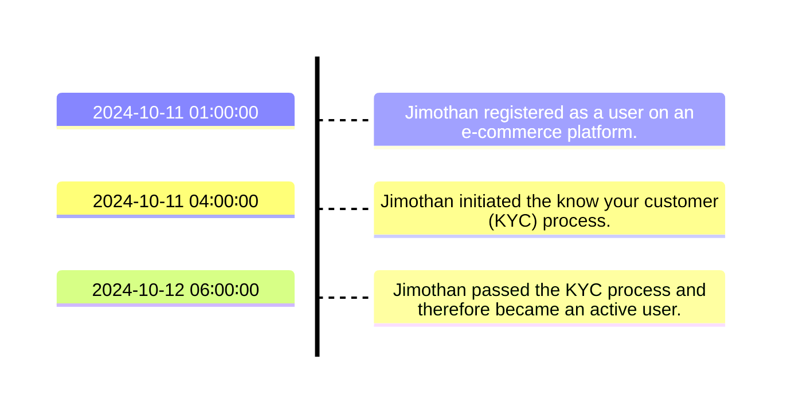
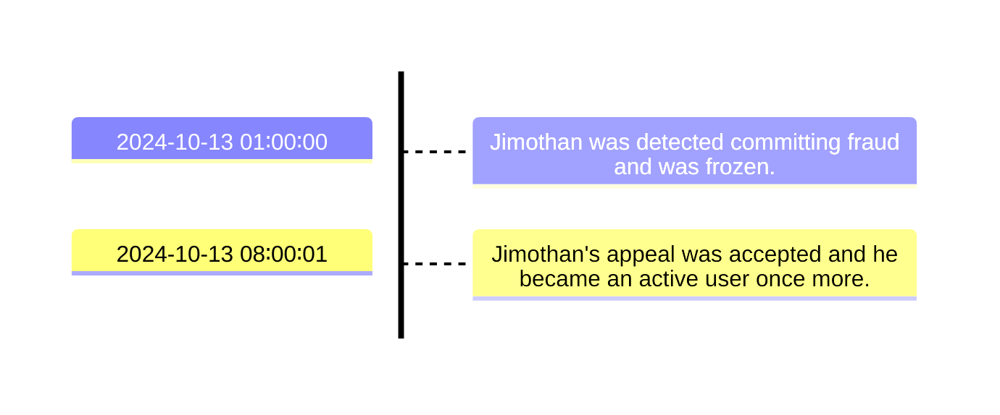
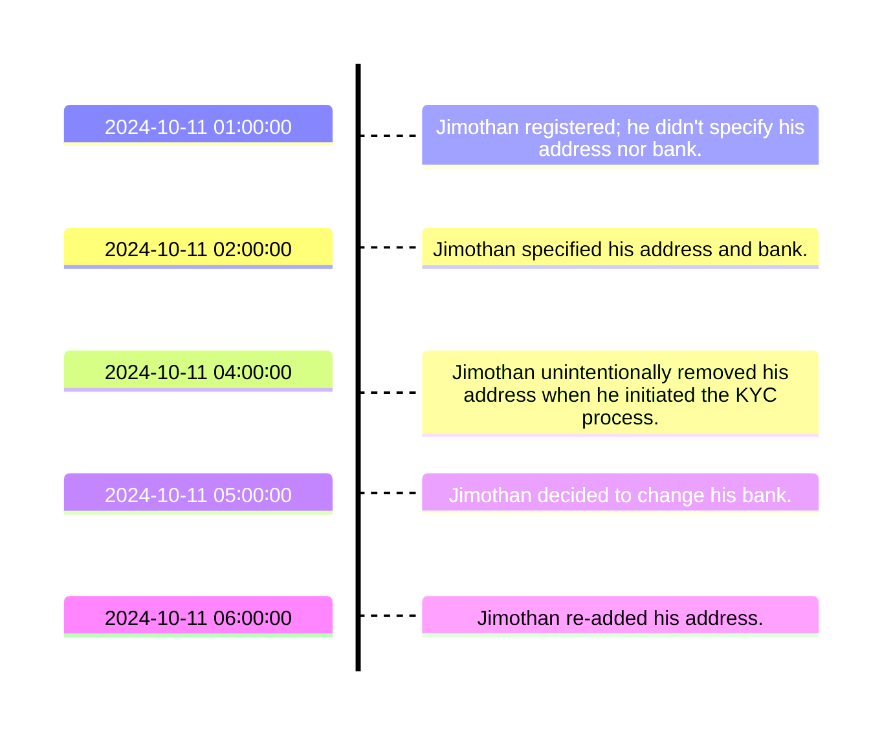
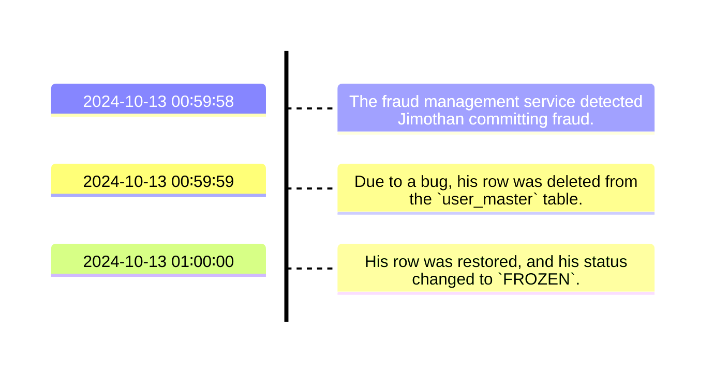
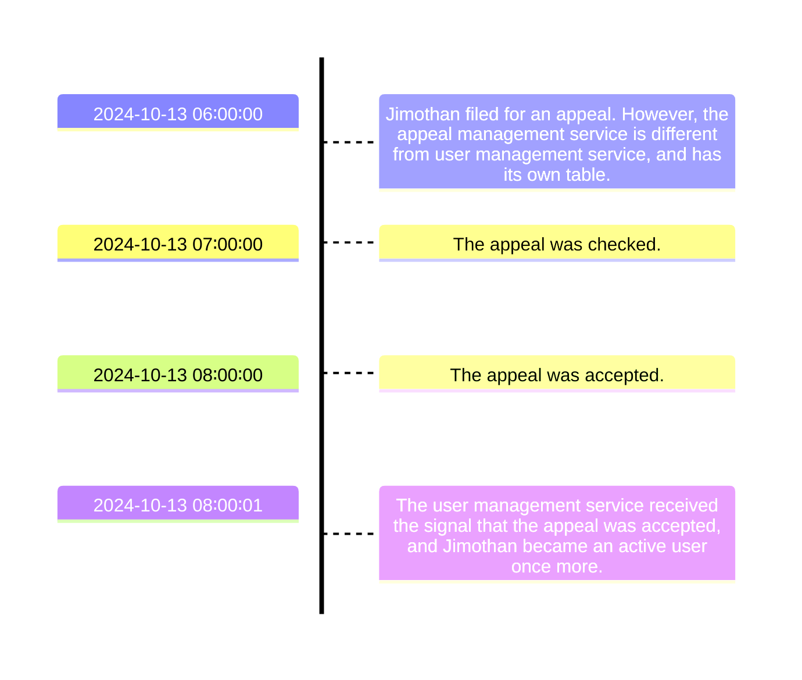

# 2025-02-28 Data Warehouse Guideline - SCD2

By [Vincentius Timothy](https://registry.jsonresume.org/vincentimo). Originally published on [AppFlowy](https://appflowy.com/41518cd2-22c3-48b9-bd3e-9ffeac63d8d0/2025-02-21-SC-feb534c3-477a-4d2b-9345-047777925a47).

<!-- toc-gitlab:start mode=full -->
## Contents<br>
1. [Background](#background)
2. [Included knowledge](#included-knowledge)
3. [Implementation notes](#implementation-notes)
4. [What is an SCD2 table?](#what-is-an-scd2-table)
5. [How to use an SCD2 table?](#how-to-use-an-scd2-table)
	1. [Use case 1: Getting the current state of an entity](#use-case-1-getting-the-current-state-of-an-entity)
	2. [Use case 2: Getting the state of an entity during a specific timestamp](#use-case-2-getting-the-state-of-an-entity-during-a-specific-timestamp)
6. [How to develop an SCD2 table?](#how-to-develop-an-scd2-table)
	1. [Use case 1: There is 1 source; tracking 1 column; the data is clean](#use-case-1-there-is-1-source-tracking-1-column-the-data-is-clean)
	2. [Use case 2: There is 1 source; tracking 1 column; other columns are updated](#use-case-2-there-is-1-source-tracking-1-column-other-columns-are-updated)
	3. [Use case 3: There is 1 source; tracking > 1 columns; other columns are updated](#use-case-3-there-is-1-source-tracking--1-columns-other-columns-are-updated)
	4. [Use case 4: There is 1 source; tracking > 1 columns; there is duplicated begin_time](#use-case-4-there-is-1-source-tracking--1-columns-there-is-duplicated-begin_time)
	5. [Use case 5: There is 1 source; tracking > 1 columns; there is hard-deletion](#use-case-5-there-is-1-source-tracking--1-columns-there-is-hard-deletion)
	6. [Use case 6: There are > 1 sources](#use-case-6-there-are--1-sources)
	7. [Use case 7: Incremental processing for SCD2 table](#use-case-7-incremental-processing-for-scd2-table)
7. [Summary](#summary)
<!-- toc-gitlab:end -->

## Background

A [Slowly Changing Dimension Type-2](https://en.wikipedia.org/wiki/Slowly_changing_dimension#Type_2:_add_new_row) (SCD2) table plays a crucial role in [dimensional modeling](https://en.wikipedia.org/wiki/Dimensional_modeling) by tracking historical changes of an entity. However, this added complexity makes both its development and usage more challenging than regular tables.

This article serves as a comprehensive guide for both users and developers, covering:

1. What an SCD2 table is.
2. How to use an SCD2 table effectively.
3. How to develop an SCD2 table—starting with simpler use cases and progressing to more complex ones, including hard-deletions, unifying multiple sources, and incremental processing.
4. How to implement these concepts in both [GoogleSQL](https://cloud.google.com/bigquery/docs/introduction-sql) and [SparkSQL 3.2.1](https://archive.apache.org/dist/spark/docs/3.2.1/sql-ref-functions-builtin.html).

All use cases have been production-tested in [SparkSQL 3.2.1](https://archive.apache.org/dist/spark/docs/3.2.1/sql-ref-functions-builtin.html) during [my time](https://www.linkedin.com/in/vincentius-timothy/) as a Data Engineer at Tokopedia | ByteDance.

## Included knowledge

This section covers these foundational topics to help you understand, use, and develop an SCD2 table.

To understand and use an SCD2 table, we'll explore:

1. Concept: Data Warehouse and dimensional modeling, especially fact and dimension tables.
2. SQL: Fundamental SQL, especially filtering and joining.

To develop an SCD2 table, in addition to the above, we'll also explore:

1. SQL: Subquery, common table expressions (CTEs), and nested CTEs.
2. SQL: Window functions, especially `LEAD()`, `LAG()`, `ROW_NUMBER()`, and named windows.
3. SQL: Handling `NULL` values in comparison operator, null-safe equal operator.
4. SQL: Creating and using `STRUCT()`.
5. SQL: Union operations, especially `UNION DISTINCT` and `UNION ALL`.

## Implementation notes

All queries are shown in [GoogleSQL](https://cloud.google.com/bigquery/docs/introduction-sql). The [SparkSQL 3.2.1](https://archive.apache.org/dist/spark/docs/3.2.1/sql-ref-functions-builtin.html) implementation is mostly identical; the key difference is null-safe equality operator:

| [GoogleSQL](https://cloud.google.com/bigquery/docs/introduction-sql) | [SparkSQL 3.2.1](https://archive.apache.org/dist/spark/docs/3.2.1/sql-ref-functions-builtin.html) |
| -------------------------------------------------------------------- | ------------------------------------------------------------------------------------------------- |
| `column_a IS DISTINCT FROM column_b`                                 | `NOT(column_a <=> column_b)`                                                                      |

In each query, there is a note on whether the query is identical between both dialects, or not. If there is a difference, the [SparkSQL 3.2.1](https://archive.apache.org/dist/spark/docs/3.2.1/sql-ref-functions-builtin.html) version is written inside the comment `/* SparkSQL: ... */`.

All queries are ready to execute, as they include the necessary source data.

## What is an SCD2 table?

An SCD2 table is a type of [dimension table](https://en.wikipedia.org/wiki/Dimension_\(data_warehouse\)#Dimension_table) that tracks historical changes of an entity. Consider the following scenario about a user.



It can be represented as an SCD2 table like this:

`dim_user_scd2`

| 🔑 user_id | status  | 🔑 begin_time       | end_time            | is_current |
| ---------- | ------- | ------------------- | ------------------- | ---------- |
| 1          | INITIAL | 2024-10-11 01:00:00 | 2024-10-11 04:00:00 | FALSE      |
| 1          | ON_KYC  | 2024-10-11 04:00:00 | 2024-10-12 06:00:00 | FALSE      |
| 1          | ACTIVE  | 2024-10-12 06:00:00 | 9999-12-31 00:00:00 | TRUE       |

How to read this table?

1. 🔑: The primary key of that table. In this case, `{user_id, begin_time}`.
2. `begin_time`: The timestamp (inclusive) that denotes when a state starts.
3. `end_time`: The timestamp (exclusive) that denotes when a state ends.
4. `is_current`: Indicator if a row represents the current state.

Notes:

1. The `end_time` of row-[n] must always be the same as the `begin_time` of row-[n+1], except for the last row of an entity (i.e., the row where `is_current` is `TRUE`). In this case, it is assigned a timestamp in the far future. In this example, it's `9999-12-31 00:00:00`.
2. Why don't we just assign `NULL` to the last row of `end_time`? It will cause more complexity when using the SCD2 table.

Now consider a scenario where Jimothan committed fraud.



The SCD2 table becomes this:

`dim_user_scd2`

| 🔑 user_id | status  | 🔑 begin_time       | end_time                                       | is_current        |
| ---------- | ------- | ------------------- | ---------------------------------------------- | ----------------- |
| 1          | INITIAL | 2024-10-11 01:00:00 | 2024-10-11 04:00:00                            | FALSE             |
| 1          | ON_KYC  | 2024-10-11 04:00:00 | 2024-10-12 06:00:00                            | FALSE             |
| 1          | ACTIVE  | 2024-10-12 06:00:00 | ~~9999-12-31 00:00:00~~<br>2024-10-13 01:00:00 | ~~TRUE~~<br>FALSE |
| 1          | FROZEN  | 2024-10-13 01:00:00 | 2024-10-13 08:00:01                            | FALSE             |
| 1          | ACTIVE  | 2024-10-13 08:00:01 | 9999-12-31 00:00:00                            | TRUE              |

What happened to this table?

1. In the last row of an entity, the `end_time` and `is_current` are updated to the `begin_time` of the next row's `begin_time` and `FALSE`, respectively.
2. New rows are added to store the newest changes, where the `end_time` follows the previous rules.

> [!NOTE] An SCD2 table stores historical data. It is enriched with `begin_time`, `end_time`, and `is_current` to accurately pinpoint when a state exactly happened.

## How to use an SCD2 table?

There are two use cases of using an SCD2 table. They are mutually-exclusive, so feel free to start from any use case that suits your needs.

### Use case 1: Getting the current state of an entity

An analyst wants to know the current state of the user like this:

| 🔑 user_id | status |
| ---------- | ------ |
| 1          | ACTIVE |

How to obtain this table?

```sql
/* Query is identical between GoogleSQL and SparkSQL */
WITH
	dim_user_scd2 AS (
		SELECT 1 AS user_id, 'INITIAL' AS status, TIMESTAMP('2024-10-11 01:00:00') AS begin_time, TIMESTAMP('2024-10-11 04:00:00') AS end_time, FALSE AS is_current
		UNION ALL SELECT 1, 'ON_KYC', TIMESTAMP('2024-10-11 04:00:00'), TIMESTAMP('2024-10-12 06:00:00'), FALSE
		UNION ALL SELECT 1, 'ACTIVE', TIMESTAMP('2024-10-12 06:00:00'), TIMESTAMP('2024-10-13 01:00:00'), FALSE
		UNION ALL SELECT 1, 'FROZEN', TIMESTAMP('2024-10-13 01:00:00'), TIMESTAMP('2024-10-13 08:00:01'), FALSE
		UNION ALL SELECT 1, 'ACTIVE', TIMESTAMP('2024-10-13 08:00:01'), TIMESTAMP('9999-12-31 00:00:00'), TRUE
	)
SELECT
	user_id,
	status
FROM
	dim_user_scd2
WHERE
	is_current;
```

What happened in this query?

1. Filter `is_current` is used because it represents the current state.

> [!NOTE] To get the current state of an entity from an SCD2 table, use filter `is_current`.

### Use case 2: Getting the state of an entity during a specific timestamp

Consider a table that stores orders like this:

`fact_order`

| 🔑 order_id | user_id | pay_time            | pay_amount |
| ----------- | ------- | ------------------- | ---------- |
| 1           | 1       | 2024-01-11 02:00:00 | 100,000    |
| 2           | 1       | 2024-01-11 03:00:00 | 200,000    |
| 3           | 1       | 2024-01-11 08:00:00 | 300,000    |
| 4           | 1       | 2024-01-12 12:00:00 | 400,000    |

An analyst wants to know the `user_status` for each order based on the `pay_time` to create this table:

| 🔑 order_id | user_id | user_status | pay_time            | pay_amount |
| ----------- | ------- | ----------- | ------------------- | ---------- |
| 1           | 1       | INITIAL     | 2024-01-11 02:00:00 | 100,000    |
| 2           | 1       | INITIAL     | 2024-01-11 03:00:00 | 200,000    |
| 3           | 1       | ON_KYC      | 2024-01-11 08:00:00 | 300,000    |
| 4           | 1       | ACTIVE      | 2024-01-12 12:00:00 | 400,000    |

How to create this table?

```sql
/* Query is identical between GoogleSQL and SparkSQL */
WITH
	fact_order AS (
		SELECT 1 AS order_id, 1 AS user_id, TIMESTAMP('2024-10-11 02:00:00') AS pay_time, 100000 AS pay_amount
		UNION ALL SELECT 2, 1, TIMESTAMP('2024-10-11 03:00:00'), 200000
		UNION ALL SELECT 3, 1, TIMESTAMP('2024-10-11 08:00:00'), 300000
		UNION ALL SELECT 4, 1, TIMESTAMP('2024-10-12 12:00:00'), 400000
	),
	dim_user_scd2 AS (
		SELECT 1 AS user_id, 'INITIAL' AS status, TIMESTAMP('2024-10-11 01:00:00') AS begin_time, TIMESTAMP('2024-10-11 04:00:00') AS end_time, FALSE AS is_current
		UNION ALL SELECT 1, 'ON_KYC', TIMESTAMP('2024-10-11 04:00:00'), TIMESTAMP('2024-10-12 06:00:00'), FALSE
		UNION ALL SELECT 1, 'ACTIVE', TIMESTAMP('2024-10-12 06:00:00'), TIMESTAMP('2024-10-13 01:00:00'), FALSE
		UNION ALL SELECT 1, 'FROZEN', TIMESTAMP('2024-10-13 01:00:00'), TIMESTAMP('2024-10-13 08:00:01'), FALSE
		UNION ALL SELECT 1, 'ACTIVE', TIMESTAMP('2024-10-13 08:00:01'), TIMESTAMP('9999-12-31 00:00:00'), TRUE
	)
SELECT
	fact_order.order_id,
	fact_order.user_id,
	dim_user_scd2.status AS user_status,
	fact_order.pay_time,
	fact_order.pay_amount
FROM
	fact_order
LEFT JOIN
	dim_user_scd2
ON
	fact_order.user_id = dim_user_scd2.user_id
	AND fact_order.pay_time >= dim_user_scd2.begin_time
	AND fact_order.pay_time < dim_user_scd2.end_time;
```

What happened in this query?

1. To use an SCD2 table, make sure to join not only the business key but also `begin_time` and `end_time`.
2. You'll need to know exactly which time column on the main table used to compare with the SCD2 table. In this case, it uses `pay_time`.
3. `begin_time` is compared with `>=` operator because `begin_time` is inclusive.
4. `end_time` is compared with `<` operator because `end_time` is exclusive.
5. This is why the last row of `end_time` is not assigned `NULL`. The query will be slightly more complex to handle it.

> [!NOTE] To get the state of an entity stored on an SCD2 table during an event, make sure to join not only the business key but also `begin_time` and `end_time`.

## How to develop an SCD2 table?

The development of an SCD2 table is presented as increasingly complex use cases, where the concept in use case-[n] will be used as a foundation in use case-[n+1]. Because of this, start from use case 1.

### Use case 1: There is 1 source; tracking 1 column; the data is clean

Let's consider the source:

`user_history`

| 🔑 user_history_id | user_id | status  | create_time         | update_time         |
| ------------------ | ------- | ------- | ------------------- | ------------------- |
| 1                  | 1       | INITIAL | 2024-10-11 01:00:00 | 2024-10-11 01:00:00 |
| 2                  | 1       | ON_KYC  | 2024-10-11 01:00:00 | 2024-10-11 04:00:00 |
| 3                  | 1       | ACTIVE  | 2024-10-11 01:00:00 | 2024-10-12 06:00:00 |

We want to track the changes of `status`. Here's the expected result:

`dim_user_scd2`

| 🔑 user_id | status  | 🔑 begin_time       | end_time            | is_current |
| ---------- | ------- | ------------------- | ------------------- | ---------- |
| 1          | INITIAL | 2024-10-11 01:00:00 | 2024-10-11 04:00:00 | FALSE      |
| 1          | ON_KYC  | 2024-10-11 04:00:00 | 2024-10-12 06:00:00 | FALSE      |
| 1          | ACTIVE  | 2024-10-12 06:00:00 | 9999-12-31 00:00:00 | TRUE       |

How to create the SCD2 table?

```sql
/* Query is identical between GoogleSQL and SparkSQL */
WITH
	user_history AS (
		SELECT 1 AS user_history_id, 1 AS user_id, 'INITIAL' AS status, TIMESTAMP('2024-10-11 01:00:00') AS create_time, TIMESTAMP('2024-10-11 01:00:00') AS update_time
		UNION ALL SELECT 2, 1, 'ON_KYC', TIMESTAMP('2024-10-11 01:00:00'), TIMESTAMP('2024-10-11 04:00:00')
		UNION ALL SELECT 3, 1, 'ACTIVE', TIMESTAMP('2024-10-11 01:00:00'), TIMESTAMP('2024-10-12 06:00:00')
	),
	get_data AS (
		SELECT
			user_id,
			status,
			update_time AS begin_time
		FROM
			user_history
	)
SELECT
	user_id,
	status,
	begin_time,
	LEAD(begin_time, 1, TIMESTAMP('9999-12-31 00:00:00')) OVER(w) AS end_time,
	LEAD(begin_time) OVER(w) IS NULL AS is_current
FROM
	get_data
WINDOW
	w AS (PARTITION BY user_id ORDER BY begin_time);
```

What happened in this query?

1. `end_time` is always equal to the next `begin_time`. Furthermore, the last row of `end_time` must not be `NULL`; instead, it will be assigned a timestamp in the far future. That's why the 3-parameter `LEAD()` window function is used.
2. `is_current` is `TRUE` only in the last row of an entity. That's why we compare the result of 1-parameter `LEAD()` to `NULL`.
3. `WINDOW`: We use named window to make the query performance more efficient, because `end_time` and `is_current` use the same window definition.

Notes:

1. You must make sure that `begin_time` never contains `NULL` values nor duplicate values. (Why? Please deduce it as an exercise.) The query above assumes `update_time` doesn't contain `NULL` values—if it does, a viable strategy is to use `COALESCE(update_time, create_time) AS begin_time`.

### Use case 2: There is 1 source; tracking 1 column; other columns are updated

Let's consider the source, now with two additional columns: `address` and `bank`.

`user_history`

| 🔑 user_history_id | user_id | status  | address | bank   | create_time         | update_time         |
| ------------------ | ------- | ------- | ------- | ------ | ------------------- | ------------------- |
| 1                  | 1       | INITIAL | `NULL`  | `NULL` | 2024-10-11 01:00:00 | 2024-10-11 01:00:00 |
| 2                  | 1       | INITIAL | Jakarta | BCA    | 2024-10-11 01:00:00 | 2024-10-11 02:00:00 |
| 3                  | 1       | ON_KYC  | `NULL`  | BCA    | 2024-10-11 01:00:00 | 2024-10-11 04:00:00 |
| 4                  | 1       | ON_KYC  | `NULL`  | JAGO   | 2024-10-11 01:00:00 | 2024-10-11 05:00:00 |
| 5                  | 1       | ON_KYC  | Jakarta | JAGO   | 2024-10-11 01:00:00 | 2024-10-11 06:00:00 |
| 6                  | 1       | ACTIVE  | Jakarta | JAGO   | 2024-10-11 01:00:00 | 2024-10-12 06:00:00 |

What happened with this table?



Now, we want to track the changes of `address`. Here's the expected result:

`dim_user_scd2`

| 🔑 user_id | address | 🔑 begin_time       | end_time            | is_current |
| ---------- | ------- | ------------------- | ------------------- | ---------- |
| 1          | `NULL`  | 2024-10-11 01:00:00 | 2024-10-11 02:00:00 | FALSE      |
| 1          | Jakarta | 2024-10-11 02:00:00 | 2024-10-11 04:00:00 | FALSE      |
| 1          | `NULL`  | 2024-10-11 04:00:00 | 2024-10-11 06:00:00 | FALSE      |
| 1          | Jakarta | 2024-10-11 06:00:00 | 9999-12-31 00:00:00 | TRUE       |

What happened in this table?

1. From the perspective of tracking the changes of `address` (regardless of the changes of `status` and `bank`), there will be multiple rows with unchanged `address` (`user_history_id` = 3 and 4 are `NULL`; `user_history_id` = 5 and 6 are Jakarta).
2. In the SCD2 table, we'd want to combine unchanged rows with the proper `begin_time` and `end_time`.
3. By default, `NULL` values, including in the initial row, should be included in the SCD2 table. `NULL` itself is a valid state, and excluding these rows means losing part of the historical record. (Also, your user might ask you why there's a gap between `begin_time` and the previous row's `end_time`, and you'll need to spend precious time and effort checking the source table. Might be based on true story.)

How to create the SCD2 table?

```sql
/* Query is in GoogleSQL; the SparkSQL version is written inside the comment */
WITH
	user_history AS (
		SELECT 1 AS user_history_id, 1 AS user_id, 'INITIAL' AS status, CAST(NULL AS STRING) AS address, CAST(NULL AS STRING) AS bank, TIMESTAMP('2024-10-11 01:00:00') AS create_time, TIMESTAMP('2024-10-11 01:00:00') AS update_time
		UNION ALL SELECT 2, 1, 'INITIAL', 'Jakarta', 'BCA', TIMESTAMP('2024-10-11 01:00:00'), TIMESTAMP('2024-10-11 02:00:00')
		UNION ALL SELECT 3, 1, 'ON_KYC', NULL, 'BCA', TIMESTAMP('2024-10-11 01:00:00'), TIMESTAMP('2024-10-11 04:00:00')
		UNION ALL SELECT 4, 1, 'ON_KYC', NULL, 'JAGO', TIMESTAMP('2024-10-11 01:00:00'), TIMESTAMP('2024-10-11 05:00:00')
		UNION ALL SELECT 5, 1, 'ON_KYC', 'Jakarta', 'JAGO', TIMESTAMP('2024-10-11 01:00:00'), TIMESTAMP('2024-10-11 06:00:00')
		UNION ALL SELECT 6, 1, 'ACTIVE', 'Jakarta', 'JAGO', TIMESTAMP('2024-10-11 01:00:00'), TIMESTAMP('2024-10-12 06:00:00')
	),
	get_data AS (
		SELECT
			*,
			ROW_NUMBER() OVER(w) AS rn,
			LAG(address) OVER(w) AS lag_address
		FROM (
			SELECT
				user_id,
				address,
				update_time AS begin_time
			FROM
				user_history
		)
		WINDOW
			w AS (PARTITION BY user_id ORDER BY begin_time)
	)
SELECT
	user_id,
	address,
	begin_time,
	LEAD(begin_time, 1, TIMESTAMP('9999-12-31 00:00:00')) OVER(w) AS end_time,
	LEAD(begin_time) OVER(w) IS NULL AS is_current
FROM
	get_data
WHERE
	rn = 1
	OR address IS DISTINCT FROM lag_address /* SparkSQL: OR NOT(address <=> lag_address) */
WINDOW
	w AS (PARTITION BY user_id ORDER BY begin_time);
```

What happened in this query?

1. `SELECT *` : Normally not recommended, but permitted here since we're in full control of the selected rows from the subquery.
2. `ROW_NUMBER()`: We want to always get the initial row.
3. `LAG(address)`: We want to get the previous address because we'd need it to eliminate "duplicating" rows with unchanged address.
4. `WHERE`: We want to pick the first row, as well as changed rows in the tracked columns. We use null-safe equal operator because we want to treat `NULL` values as being different to non-`NULL` values while being equal to other `NULL` values. To make it clear, here's the result of CTE `get_data`:

| user_id | address | begin_time          | rn  | lag_address | Pick this row?             |
| ------- | ------- | ------------------- | --- | ----------- | -------------------------- |
| 1       | `NULL`  | 2024-10-11 01:00:00 | 1   | `NULL`      | ✅ The initial row          |
| 1       | Jakarta | 2024-10-11 02:00:00 | 2   | `NULL`      | ✅ The value changes        |
| 1       | `NULL`  | 2024-10-11 04:00:00 | 3   | Jakarta     | ✅ The value changes        |
| 1       | `NULL`  | 2024-10-11 05:00:00 | 4   | `NULL`      | ❌ The value doesn't change |
| 1       | Jakarta | 2024-10-11 06:00:00 | 5   | `NULL`      | ✅ The value changes        |
| 1       | Jakarta | 2024-10-12 06:00:00 | 6   | Jakarta     | ❌ The value doesn't change |

Notes:

1. Different SQL dialect might implement null-safe equal operator differently. Depending on your SQL dialect, here's another popular way to do this: `NOT(address <=> lag_address)`.

### Use case 3: There is 1 source; tracking > 1 columns; other columns are updated

Let's consider the same condition as use case 2, but we want to track both `status` and `address`, and we don't care about `bank`. Here's the expected result:

`dim_user_scd2`

| 🔑 user_id | status  | address | 🔑 begin_time       | end_time            | is_current |
| ---------- | ------- | ------- | ------------------- | ------------------- | ---------- |
| 1          | INITIAL | `NULL`  | 2024-10-11 01:00:00 | 2024-10-11 02:00:00 | FALSE      |
| 1          | INITIAL | Jakarta | 2024-10-11 02:00:00 | 2024-10-11 04:00:00 | FALSE      |
| 1          | ON_KYC  | `NULL`  | 2024-10-11 04:00:00 | 2024-10-11 06:00:00 | FALSE      |
| 1          | ON_KYC  | Jakarta | 2024-10-11 06:00:00 | 2024-10-12 06:00:00 | FALSE      |
| 1          | ACTIVE  | Jakarta | 2024-10-12 06:00:00 | 9999-12-31 00:00:00 | TRUE       |

How to create the SCD2 table?

```sql
/* Query is in GoogleSQL; the SparkSQL version is written inside the comment */
WITH
	user_history AS (
		SELECT 1 AS user_history_id, 1 AS user_id, 'INITIAL' AS status, CAST(NULL AS STRING) AS address, CAST(NULL AS STRING) AS bank, TIMESTAMP('2024-10-11 01:00:00') AS create_time, TIMESTAMP('2024-10-11 01:00:00') AS update_time
		UNION ALL SELECT 2, 1, 'INITIAL', 'Jakarta', 'BCA', TIMESTAMP('2024-10-11 01:00:00'), TIMESTAMP('2024-10-11 02:00:00')
		UNION ALL SELECT 3, 1, 'ON_KYC', NULL, 'BCA', TIMESTAMP('2024-10-11 01:00:00'), TIMESTAMP('2024-10-11 04:00:00')
		UNION ALL SELECT 4, 1, 'ON_KYC', NULL, 'JAGO', TIMESTAMP('2024-10-11 01:00:00'), TIMESTAMP('2024-10-11 05:00:00')
		UNION ALL SELECT 5, 1, 'ON_KYC', 'Jakarta', 'JAGO', TIMESTAMP('2024-10-11 01:00:00'), TIMESTAMP('2024-10-11 06:00:00')
		UNION ALL SELECT 6, 1, 'ACTIVE', 'Jakarta', 'JAGO', TIMESTAMP('2024-10-11 01:00:00'), TIMESTAMP('2024-10-12 06:00:00')
	),
	get_data AS (
		SELECT
			*,
			ROW_NUMBER() OVER(w) AS rn,
			LAG(STRUCT(status, address)) OVER(w) AS lag_info
		FROM (
			SELECT
				user_id,
				status,
				address,
				update_time AS begin_time
			FROM
				user_history
		)
		WINDOW
			w AS (PARTITION BY user_id ORDER BY begin_time)
	)
SELECT
	user_id,
	status,
	address,
	begin_time,
	LEAD(begin_time, 1, TIMESTAMP('9999-12-31 00:00:00')) OVER(w) AS end_time,
	LEAD(begin_time) OVER(w) IS NULL AS is_current
FROM
	get_data
WHERE
	rn = 1
	OR status IS DISTINCT FROM lag_info.status /* SparkSQL: OR NOT(status <=> lag_info.status) */
	OR address IS DISTINCT FROM lag_info.address /* SparkSQL: OR NOT(address <=> lag_info.address) */
WINDOW
	w AS (PARTITION BY user_id ORDER BY begin_time);
```

What happened in this query?

1. `LAG(STRUCT(status, address))`: We want to get the previous `status` and `address`, but we don't want to invoke multiple `LAG()` functions for code readability and maintenance. So the solution is to wrap all columns we want to track inside `STRUCT()`.
2. `WHERE`: We want to pick the first row, as well as changed rows in the tracked columns. Feel free to verify the logic with the same approach as use case 2.

### Use case 4: There is 1 source; tracking > 1 columns; there is duplicated begin_time

Let's start from use case 2, now with an additional rows:

`user_history`

| 🔑 user_history_id | user_id | status  | address     | bank   | create_time         | update_time         |
| ------------------ | ------- | ------- | ----------- | ------ | ------------------- | ------------------- |
| 1                  | 1       | INITIAL | `NULL`      | `NULL` | 2024-10-11 01:00:00 | 2024-10-11 01:00:00 |
| 2                  | 1       | INITIAL | Jakarta     | BCA    | 2024-10-11 01:00:00 | 2024-10-11 02:00:00 |
| 3                  | 1       | ON_KYC  | `NULL`      | BCA    | 2024-10-11 01:00:00 | 2024-10-11 04:00:00 |
| 4                  | 1       | ON_KYC  | `NULL`      | JAGO   | 2024-10-11 01:00:00 | 2024-10-11 05:00:00 |
| 5                  | 1       | ON_KYC  | Jakarta     | JAGO   | 2024-10-11 01:00:00 | 2024-10-11 06:00:00 |
| 6                  | 1       | ACTIVE  | Jakarta     | JAGO   | 2024-10-11 01:00:00 | 2024-10-12 06:00:00 |
| 7                  | 1       | INITIAL | DKI Jakarta | BCA    | 2024-10-11 01:00:00 | 2024-10-11 02:00:00 |
| 8                  | 1       | ON_KYC  | DKI Jakarta | JAGO   | 2024-10-11 01:00:00 | 2024-10-11 06:00:00 |
| 9                  | 1       | ACTIVE  | DKI Jakarta | JAGO   | 2024-10-11 01:00:00 | 2024-10-12 06:00:00 |

What happened with this table?

1. Apparently, the region team misinputted "DKI Jakarta" as "Jakarta". As a result, any existing rows with "Jakarta" was backfilled by adding new rows with the correct value.
2. However, this causes and issue where the `update_time` has the same value (`user_history_id` = 2 and 7; 5 and 8; 6 and 9).

We still want to track both `status` and `address`. Here's the expected result:

`dim_user_scd2`

| 🔑 user_id | status  | address     | 🔑 begin_time       | end_time            | is_current |
| ---------- | ------- | ----------- | ------------------- | ------------------- | ---------- |
| 1          | INITIAL | `NULL`      | 2024-10-11 01:00:00 | 2024-10-11 02:00:00 | FALSE      |
| 1          | INITIAL | DKI Jakarta | 2024-10-11 02:00:00 | 2024-10-11 04:00:00 | FALSE      |
| 1          | ON_KYC  | `NULL`      | 2024-10-11 04:00:00 | 2024-10-11 06:00:00 | FALSE      |
| 1          | ON_KYC  | DKI Jakarta | 2024-10-11 06:00:00 | 2024-10-12 06:00:00 | FALSE      |
| 1          | ACTIVE  | DKI Jakarta | 2024-10-12 06:00:00 | 9999-12-31 00:00:00 | TRUE       |

How to create the SCD2 table?

```sql
/* Query is in GoogleSQL; the SparkSQL version is written inside the comment */
WITH
	user_history AS (
		SELECT 1 AS user_history_id, 1 AS user_id, 'INITIAL' AS status, CAST(NULL AS STRING) AS address, CAST(NULL AS STRING) AS bank, TIMESTAMP('2024-10-11 01:00:00') AS create_time, TIMESTAMP('2024-10-11 01:00:00') AS update_time
		UNION ALL SELECT 2, 1, 'INITIAL', 'Jakarta', 'BCA', TIMESTAMP('2024-10-11 01:00:00'), TIMESTAMP('2024-10-11 02:00:00')
		UNION ALL SELECT 3, 1, 'ON_KYC', NULL, 'BCA', TIMESTAMP('2024-10-11 01:00:00'), TIMESTAMP('2024-10-11 04:00:00')
		UNION ALL SELECT 4, 1, 'ON_KYC', NULL, 'JAGO', TIMESTAMP('2024-10-11 01:00:00'), TIMESTAMP('2024-10-11 05:00:00')
		UNION ALL SELECT 5, 1, 'ON_KYC', 'Jakarta', 'JAGO', TIMESTAMP('2024-10-11 01:00:00'), TIMESTAMP('2024-10-11 06:00:00')
		UNION ALL SELECT 6, 1, 'ACTIVE', 'Jakarta', 'JAGO', TIMESTAMP('2024-10-11 01:00:00'), TIMESTAMP('2024-10-12 06:00:00')
		UNION ALL SELECT 7, 1, 'INITIAL', 'DKI Jakarta', 'BCA', TIMESTAMP('2024-10-11 01:00:00'), TIMESTAMP('2024-10-11 02:00:00')
		UNION ALL SELECT 8, 1, 'ON_KYC', 'DKI Jakarta', 'JAGO', TIMESTAMP('2024-10-11 01:00:00'), TIMESTAMP('2024-10-11 06:00:00')
		UNION ALL SELECT 9, 1, 'ACTIVE', 'DKI Jakarta', 'JAGO', TIMESTAMP('2024-10-11 01:00:00'), TIMESTAMP('2024-10-12 06:00:00')
	),
	get_data AS (
		SELECT
			*,
			ROW_NUMBER() OVER(w) AS rn,
			LAG(STRUCT(begin_time, status, address)) OVER(w) AS lag_info
		FROM (
			SELECT
				user_history_id,
				user_id,
				status,
				address,
				update_time AS begin_time
			FROM
				user_history
		)
		WINDOW
			w AS (PARTITION BY user_id ORDER BY begin_time, user_history_id DESC)
	)
SELECT
	user_id,
	status,
	address,
	begin_time,
	LEAD(begin_time, 1, TIMESTAMP('9999-12-31 00:00:00')) OVER(w) AS end_time,
	LEAD(begin_time) OVER(w) IS NULL AS is_current
FROM
	get_data
WHERE
	rn = 1
	OR (
		begin_time IS DISTINCT FROM lag_info.begin_time /* SparkSQL: NOT(begin_time <=> lag_info.begin_time) */
		AND (
			status IS DISTINCT FROM lag_info.status /* Spark SQL: NOT(status <=> lag_info.status) */
			OR address IS DISTINCT FROM lag_info.address /* Spark SQL: OR NOT(address <=> lag_info.address) */
		)
	)
WINDOW
	w AS (PARTITION BY user_id ORDER BY begin_time);
```

What happened in this query?

1. `LAG(STRUCT(begin_time, status, address))`: We want to get the previous `begin_time` as well.
2. `ORDER BY begin_time, user_history_id DESC`: If two rows have the same `begin_time`, we want to pick the latest `user_history_id`.
3. `WHERE`: We want to pick `begin_time` with different values. Feel free to verify the logic with the same approach as use case 2.

Notes:

1. Not all tables might have `user_history_id`. In this case, find another column that can be used to order `lag_info`. For example, if you use [change data capture](https://en.wikipedia.org/wiki/Change_data_capture) (CDC), you can pick the time when the change was detected (e.g., on Debezium, you can use `__source_ts_ms`).

### Use case 5: There is 1 source; tracking > 1 columns; there is hard-deletion

Let's start from use case 2, but Jimothan was detected committing fraud and was frozen at 2024-10-13 01:00:00.



Normally, when we ingest it from `user_history`, we couldn't capture hard-deletion. Now we try ingesting it from `user_master` using CDC, which was able to capture hard-deletion. Only relevant columns are shown.

`user_master` (ingested using CDC)

| 🔑 user_id | status  | address | bank   | __op | __source_ts_ms      |
| ---------- | ------- | ------- | ------ | ---- | ------------------- |
| 1          | INITIAL | `NULL`  | `NULL` | c    | 2024-10-11 01:00:00 |
| 1          | INITIAL | Jakarta | BCA    | u    | 2024-10-11 02:00:00 |
| 1          | ON_KYC  | `NULL`  | BCA    | u    | 2024-10-11 04:00:00 |
| 1          | ON_KYC  | `NULL`  | JAGO   | u    | 2024-10-11 05:00:00 |
| 1          | ON_KYC  | Jakarta | JAGO   | u    | 2024-10-11 06:00:00 |
| 1          | ACTIVE  | Jakarta | JAGO   | u    | 2024-10-12 06:00:00 |
| 1          | `NULL`  | `NULL`  | `NULL` | d    | 2024-10-13 00:59:59 |
| 1          | FROZEN  | Jakarta | JAGO   | c    | 2024-10-13 01:00:00 |

What happened with this table?

1. The hard-deleted rows have `NULL` values, except the primary key (`user_id`), and the metadata related to CDC.
2. Column `__op`: Represents the operation of the row: `c` for create, `u` for update, and `d` for delete.
3. Column `__source_ts_ms`: Represents the time when the change was detected.

We still want to track both `status` and `address`, but we also want to accurately track when the row was deleted. Here's the expected result:

`dim_user_scd2`

| 🔑 user_id | status  | address | is_hard_deleted | 🔑 begin_time       | end_time            | is_current |
| ---------- | ------- | ------- | --------------- | ------------------- | ------------------- | ---------- |
| 1          | INITIAL | `NULL`  | FALSE           | 2024-10-11 01:00:00 | 2024-10-11 02:00:00 | FALSE      |
| 1          | INITIAL | Jakarta | FALSE           | 2024-10-11 02:00:00 | 2024-10-11 04:00:00 | FALSE      |
| 1          | ON_KYC  | `NULL`  | FALSE           | 2024-10-11 04:00:00 | 2024-10-11 06:00:00 | FALSE      |
| 1          | ON_KYC  | Jakarta | FALSE           | 2024-10-11 06:00:00 | 2024-10-12 06:00:00 | FALSE      |
| 1          | ACTIVE  | Jakarta | FALSE           | 2024-10-12 06:00:00 | 2024-10-13 00:59:59 | FALSE      |
| 1          | ACTIVE  | Jakarta | TRUE            | 2024-10-13 00:59:59 | 2024-10-13 01:00:00 | FALSE      |
| 1          | FROZEN  | Jakarta | FALSE           | 2024-10-13 01:00:00 | 9999-12-31 00:00:00 | TRUE       |

What happened with this table?

1. There is a new column named `is_hard_deleted`, which will be marked `TRUE` if the CDC detects a hard-deletion.
2. The rows where `is_hard_deleted` is `TRUE` is filled with the last state before it was deleted, even though the CDC returns `NULL` values.

How to create the SCD2 table?

```sql
/* Query is in GoogleSQL; the SparkSQL version is written inside the comment */
WITH
	user_master AS (
		SELECT 1 AS user_id, 'INITIAL' AS status, CAST(NULL AS STRING) AS address, CAST(NULL AS STRING) AS bank, 'c' AS __op, TIMESTAMP('2024-10-11 01:00:00') AS __source_ts_ms
		UNION ALL SELECT 1, 'INITIAL', 'Jakarta', 'BCA', 'u', TIMESTAMP('2024-10-11 02:00:00')
		UNION ALL SELECT 1, 'ON_KYC', NULL, 'BCA', 'u', TIMESTAMP('2024-10-11 04:00:00')
		UNION ALL SELECT 1, 'ON_KYC', NULL, 'JAGO', 'u', TIMESTAMP('2024-10-11 05:00:00')
		UNION ALL SELECT 1, 'ON_KYC', 'Jakarta', 'JAGO', 'u', TIMESTAMP('2024-10-11 06:00:00')
		UNION ALL SELECT 1, 'ACTIVE', 'Jakarta', 'JAGO', 'u', TIMESTAMP('2024-10-12 06:00:00')
		UNION ALL SELECT 1, NULL, NULL, NULL, 'd', TIMESTAMP('2024-10-13 00:59:59')
		UNION ALL SELECT 1, 'FROZEN', 'Jakarta', 'JAGO', 'c', TIMESTAMP('2024-10-13 01:00:00')
	),
	get_data AS (
		SELECT
			*,
			ROW_NUMBER() OVER(w) AS rn,
			LAG(STRUCT(begin_time, status, address)) OVER(w) AS lag_info
		FROM (
			SELECT
				user_id,
				status,
				address,
				__op = 'd' AS is_hard_deleted,
				__source_ts_ms AS begin_time
			FROM
				user_master
		)
		WINDOW
			w AS (PARTITION BY user_id ORDER BY begin_time)
	),
	remove_duplicates AS (
		SELECT
			*,
			LEAD(STRUCT(is_hard_deleted, begin_time)) OVER(w) AS lead_info
		FROM
			get_data
		WHERE
			rn = 1
			OR (
				begin_time IS DISTINCT FROM lag_info.begin_time /* SparkSQL: NOT(begin_time <=> lag_info.begin_time) */
				AND (
					status IS DISTINCT FROM lag_info.status /* SparkSQL: NOT(status <=> lag_info.status) */
					OR address IS DISTINCT FROM lag_info.address /* SparkSQL: OR NOT(address <=> lag_info.address) */
				)
			)
		WINDOW
			w AS (PARTITION BY user_id ORDER BY begin_time)
	),
	handle_deleted_rows AS (
			SELECT
				user_id,
				status,
				address,
				is_hard_deleted,
				begin_time
			FROM
				remove_duplicates
			WHERE
				NOT is_hard_deleted
		UNION ALL
			SELECT
				user_id,
				status,
				address,
				lead_info.is_hard_deleted,
				lead_info.begin_time
			FROM
				remove_duplicates
			WHERE
				lead_info.is_hard_deleted
	)
SELECT
	*,
	LEAD(begin_time, 1, TIMESTAMP('9999-12-31 00:00:00')) OVER(w) AS end_time,
	LEAD(begin_time) OVER(w) IS NULL AS is_current
FROM
	handle_deleted_rows
WINDOW
	w AS (PARTITION BY user_id ORDER BY begin_time);
```

What happened in this query?

1. CTE `get_data`: Standard up to use case 4, but added `__op = 'd' AS is_hard_deleted` so we can get a flag for hard-deleted rows.
2. CTE `remove_duplicates`: Standard up to use case 4, but instead of calculating `end_time` and `is_current`, we calculate the next values for `is_hard_deleted` and `begin_time`.
3. CTE `handle_deleted_rows`: To ensure that deleted rows contain information about the state before it was deleted. There are two unioned parts.
	1. Part 1: To handle the non hard-deleted rows. Take the values of the current row.
	2. Part 2: To handle the hard-deleted rows. Take the values of the row before hard-deletion by detecting if the next row is hard-deleted.
	3. The row before hard-deletion will be taken twice: One as non hard-deleted row (part 1), and another as the values for hard-deleted row (part 2).
4. Main query: Normally `SELECT *` is not recommended, but permitted here since we're in full control of the selected rows from the CTE.

### Use case 6: There are > 1 sources

Let's start from use case 5. However:



So in addition to `user_master` (ingested using CDC due to the possibility of hard-deletion), we have an additional source, `appeal_history` (ingested using direct connection between RDBMS and Data Warehouse). Only relevant columns are shown.

`user_master` (ingested using CDC)

| 🔑 user_id | status  | address | bank   | __op | __source_ts_ms      |
| ---------- | ------- | ------- | ------ | ---- | ------------------- |
| 1          | INITIAL | `NULL`  | `NULL` | c    | 2024-10-11 01:00:00 |
| 1          | INITIAL | Jakarta | BCA    | u    | 2024-10-11 02:00:00 |
| 1          | ON_KYC  | `NULL`  | BCA    | u    | 2024-10-11 04:00:00 |
| 1          | ON_KYC  | `NULL`  | JAGO   | u    | 2024-10-11 05:00:00 |
| 1          | ON_KYC  | Jakarta | JAGO   | u    | 2024-10-11 06:00:00 |
| 1          | ACTIVE  | Jakarta | JAGO   | u    | 2024-10-12 06:00:00 |
| 1          | `NULL`  | `NULL`  | `NULL` | d    | 2024-10-13 00:59:59 |
| 1          | FROZEN  | Jakarta | JAGO   | c    | 2024-10-13 01:00:00 |
| 1          | ACTIVE  | Jakarta | JAGO   | c    | 2024-10-13 08:00:01 |

`appeal_history` (ingested using direct connection)

| 🔑 appeal_history_id | appeal_id | user_id | status   | create_time         | update_time         |
| -------------------- | --------- | ------- | -------- | ------------------- | ------------------- |
| 1                    | 1         | 1       | INITIAL  | 2024-10-13 06:00:00 | 2024-10-13 06:00:00 |
| 2                    | 1         | 1       | ON_CHECK | 2024-10-13 06:00:00 | 2024-10-13 07:00:00 |
| 3                    | 1         | 1       | ACCEPTED | 2024-10-13 06:00:00 | 2024-10-13 08:00:00 |

We want to track user's `status` and `address` from `user_master` as well as `status` (aliased as `appeal_status`) from `appeal_history`. Here's the expected result:

`dim_user_scd2`

| 🔑 user_id | status  | address | appeal_status | is_hard_deleted | 🔑 begin_time       | end_time            | is_current |
| ---------- | ------- | ------- | ------------- | --------------- | ------------------- | ------------------- | ---------- |
| 1          | INITIAL | `NULL`  | `NULL`        | FALSE           | 2024-10-11 01:00:00 | 2024-10-11 02:00:00 | FALSE      |
| 1          | INITIAL | Jakarta | `NULL`        | FALSE           | 2024-10-11 02:00:00 | 2024-10-11 04:00:00 | FALSE      |
| 1          | ON_KYC  | `NULL`  | `NULL`        | FALSE           | 2024-10-11 04:00:00 | 2024-10-11 06:00:00 | FALSE      |
| 1          | ON_KYC  | Jakarta | `NULL`        | FALSE           | 2024-10-11 06:00:00 | 2024-10-12 06:00:00 | FALSE      |
| 1          | ACTIVE  | Jakarta | `NULL`        | FALSE           | 2024-10-12 06:00:00 | 2024-10-13 00:59:59 | FALSE      |
| 1          | ACTIVE  | Jakarta | `NULL`        | TRUE            | 2024-10-13 00:59:59 | 2024-10-13 01:00:00 | FALSE      |
| 1          | FROZEN  | Jakarta | `NULL`        | FALSE           | 2024-10-13 01:00:00 | 2024-10-13 06:00:00 | FALSE      |
| 1          | FROZEN  | Jakarta | INITIAL       | FALSE           | 2024-10-13 06:00:00 | 2024-10-13 07:00:00 | FALSE      |
| 1          | FROZEN  | Jakarta | ON_CHECK      | FALSE           | 2024-10-13 07:00:00 | 2024-10-13 08:00:00 | FALSE      |
| 1          | FROZEN  | Jakarta | ACCEPTED      | FALSE           | 2024-10-13 08:00:00 | 2024-10-13 08:00:01 | FALSE      |
| 1          | ACTIVE  | Jakarta | ACCEPTED      | FALSE           | 2024-10-13 08:00:01 | 9999-12-31 00:00:00 | TRUE       |

How to create the SCD2 table?

```sql
/* Query is in GoogleSQL; the SparkSQL version is written inside the comment */
WITH
	user_master_scd2 AS (
		WITH
			user_master AS (
				SELECT 1 AS user_id, 'INITIAL' AS status, CAST(NULL AS STRING) AS address, CAST(NULL AS STRING) AS bank, 'c' AS __op, TIMESTAMP('2024-10-11 01:00:00') AS __source_ts_ms
				UNION ALL SELECT 1, 'INITIAL', 'Jakarta', 'BCA', 'u', TIMESTAMP('2024-10-11 02:00:00')
				UNION ALL SELECT 1, 'ON_KYC', NULL, 'BCA', 'u', TIMESTAMP('2024-10-11 04:00:00')
				UNION ALL SELECT 1, 'ON_KYC', NULL, 'JAGO', 'u', TIMESTAMP('2024-10-11 05:00:00')
				UNION ALL SELECT 1, 'ON_KYC', 'Jakarta', 'JAGO', 'u', TIMESTAMP('2024-10-11 06:00:00')
				UNION ALL SELECT 1, 'ACTIVE', 'Jakarta', 'JAGO', 'u', TIMESTAMP('2024-10-12 06:00:00')
				UNION ALL SELECT 1, NULL, NULL, NULL, 'd', TIMESTAMP('2024-10-13 00:59:59')
				UNION ALL SELECT 1, 'FROZEN', 'Jakarta', 'JAGO', 'c', TIMESTAMP('2024-10-13 01:00:00')
				UNION ALL SELECT 1, 'ACTIVE', 'Jakarta', 'JAGO', 'c', TIMESTAMP('2024-10-13 08:00:01')
			),
			get_data AS (
				SELECT
					*,
					ROW_NUMBER() OVER(w) AS rn,
					LAG(STRUCT(begin_time, status, address)) OVER(w) AS lag_info
				FROM (
					SELECT
						user_id,
						status,
						address,
						__op = 'd' AS is_hard_deleted,
						__source_ts_ms AS begin_time
					FROM
						user_master
				)
				WINDOW
					w AS (PARTITION BY user_id ORDER BY begin_time)
			),
			remove_duplicates AS (
				SELECT
					*,
					LEAD(STRUCT(is_hard_deleted, begin_time)) OVER(w) AS lead_info
				FROM
					get_data
				WHERE
					rn = 1
					OR (
						begin_time IS DISTINCT FROM lag_info.begin_time /* SparkSQL: NOT(begin_time <=> lag_info.begin_time) */
						AND (
							status IS DISTINCT FROM lag_info.status /* SparkSQL: NOT(status <=> lag_info.status) */
							OR address IS DISTINCT FROM lag_info.address /* SparkSQL: OR NOT(address <=> lag_info.address) */
						)
					)
				WINDOW
					w AS (PARTITION BY user_id ORDER BY begin_time)
			),
			handle_deleted_rows AS (
					SELECT
						user_id,
						status,
						address,
						is_hard_deleted,
						begin_time
					FROM
						remove_duplicates
					WHERE
						NOT is_hard_deleted
				UNION ALL
					SELECT
						user_id,
						status,
						address,
						lead_info.is_hard_deleted,
						lead_info.begin_time
					FROM
						remove_duplicates
					WHERE
						lead_info.is_hard_deleted
			)
		SELECT
			*,
			LEAD(begin_time, 1, TIMESTAMP('9999-12-31 00:00:00')) OVER(w) AS end_time
		FROM
			handle_deleted_rows
		WINDOW
			w AS (PARTITION BY user_id ORDER BY begin_time)
	),
	appeal_history_scd2 AS (
		WITH
			appeal_history AS (
				SELECT 1 AS appeal_history_id, 1 AS appeal_id, 1 AS user_id, 'INITIAL' AS status, TIMESTAMP('2024-10-13 06:00:00') AS create_time, TIMESTAMP('2024-10-13 06:00:00') AS update_time
				UNION ALL SELECT 2, 1, 1, 'ON_CHECK', TIMESTAMP('2024-10-13 06:00:00'), TIMESTAMP('2024-10-13 07:00:00')
				UNION ALL SELECT 3, 1, 1, 'ACCEPTED', TIMESTAMP('2024-10-13 06:00:00'), TIMESTAMP('2024-10-13 08:00:00')
			),
			get_data AS (
				SELECT
					*,
					ROW_NUMBER() OVER(w) AS rn,
					LAG(STRUCT(begin_time, status)) OVER(w) AS lag_info
				FROM (
					SELECT
						appeal_history_id,
						user_id,
						status,
						update_time AS begin_time
					FROM
						appeal_history
				)
				WINDOW
					w AS (PARTITION BY user_id ORDER BY begin_time, appeal_history_id DESC)
			)
		SELECT
			user_id,
			status,
			begin_time,
			LEAD(begin_time, 1, TIMESTAMP('9999-12-31 00:00:00')) OVER(w) AS end_time
		FROM
			get_data
		WHERE
			rn = 1
			OR (
				begin_time IS DISTINCT FROM lag_info.begin_time /* SparkSQL: NOT(begin_time <=> lag_info.begin_time) */
				AND (
					status IS DISTINCT FROM lag_info.status /* SparkSQL: NOT(status <=> lag_info.status) */
				)
			)
		WINDOW
			w AS (PARTITION BY user_id ORDER BY begin_time)
	),
	timeline AS (
			SELECT
				user_id,
				begin_time
			FROM
				user_master_scd2
		UNION DISTINCT
			SELECT
				user_id,
				begin_time
			FROM
				appeal_history_scd2
	)
SELECT
	timeline.user_id,
	user_master_scd2.status,
	user_master_scd2.address,
	appeal_history_scd2.status AS appeal_status,
	user_master_scd2.is_hard_deleted,
	timeline.begin_time,
	LEAD(timeline.begin_time, 1, TIMESTAMP('9999-12-31 00:00:00')) OVER(w) AS end_time,
	LEAD(timeline.begin_time) OVER(w) IS NULL AS is_current
FROM
	timeline
LEFT JOIN
	user_master_scd2
ON
	timeline.user_id = user_master_scd2.user_id
	AND timeline.begin_time >= user_master_scd2.begin_time
	AND timeline.begin_time < user_master_scd2.end_time
LEFT JOIN
	appeal_history_scd2
ON
	timeline.user_id = appeal_history_scd2.user_id
	AND timeline.begin_time >= appeal_history_scd2.begin_time
	AND timeline.begin_time < appeal_history_scd2.end_time
WINDOW
	w AS (PARTITION BY timeline.user_id ORDER BY timeline.begin_time);
```

What happened in this query?

1. CTE `user_master_scd2`: Standard up to use case 5, because the source, `user_master`, contains hard-deletion. You'd need to create `end_time` for joining in the main query, but not `is_current`.
2. CTE `appeal_history_scd2`: Standard up to use case 4, because the source, `appeal_history`, doesn't contain hard-deletion. You'd need to create `end_time` for joining in the main query, but not `is_current`.
3. CTE `timeline`: An efficient approach to unify multiple sources to create an SCD2 table is to use unified timeline, inspired from [Minh Ngo's post in 2023](https://infinitelambda.com/multitable-scd2-joins/). The first step is to union the `begin_time` from all sources. We use `UNION DISTINCT` in case some sources contain same value for `begin_time`—remember, `begin_time` is a primary key of an SCD2 table.
4. Main query: The second step of the unified timeline approach is to get the relevant information from all sources. We do this by joining the `timeline` with all sources with the very same method as "How to use an SCD2 table?", use case 2. Also, in making the final SCD2 table, don't forget to create both `end_time` and `is_current`.

Notes:

1. You can expand the logic as required by the user. For example, the user wants only one `status` column with the following `CASE WHEN` logic. In this case, the last four rows will contain duplicated rows: two rows for each `ON_APPEAL` and `ACTIVE` status. You'll need to remove duplicating rows with the approach introduced in use case 2.

```sql
...
/* Main query */
SELECT
	timeline.user_id,
	CASE
		WHEN appeal_history_scd2.status IS NULL THEN user_master_scd2.status
		WHEN appeal_history_scd2.status <> 'ACCEPTED' THEN 'ON_APPEAL'
		WHEN appeal_history_scd2.status = 'ACCEPTED' THEN 'ACTIVE'
	END AS status,
	...
```

### Use case 7: Incremental processing for SCD2 table

So far, we have been processing the full table of `user_master` (ingested using CDC) and `appeal_history` (ingested using direct connection). However, as time goes on, the table will contain more data and the compute will get heavier. A solution is to process SCD2 table incrementally; that is, take the previous state of the SCD2 table ("base"), then only process the source data after the previous state ("delta"). After that, union base and delta get the full SCD2 table.

Consider this example. Table `dim_user_scd2` is processed daily. On 2024-10-13, it will have processed the data until just before 2024-10-13 00:00:00, so it will be like this:

`dim_user_scd2` (state as of 2024-10-13)

| 🔑 user_id | status  | address | appeal_status | is_hard_deleted | 🔑 begin_time       | end_time            | is_current |
| ---------- | ------- | ------- | ------------- | --------------- | ------------------- | ------------------- | ---------- |
| 1          | INITIAL | `NULL`  | `NULL`        | FALSE           | 2024-10-11 01:00:00 | 2024-10-11 02:00:00 | FALSE      |
| 1          | INITIAL | Jakarta | `NULL`        | FALSE           | 2024-10-11 02:00:00 | 2024-10-11 04:00:00 | FALSE      |
| 1          | ON_KYC  | `NULL`  | `NULL`        | FALSE           | 2024-10-11 04:00:00 | 2024-10-11 06:00:00 | FALSE      |
| 1          | ON_KYC  | Jakarta | `NULL`        | FALSE           | 2024-10-11 06:00:00 | 2024-10-12 06:00:00 | FALSE      |
| 1          | ACTIVE  | Jakarta | `NULL`        | FALSE           | 2024-10-12 06:00:00 | 9999-12-31 00:00:00 | TRUE       |

However, on 2024-10-13, the fraud (introduced in use case 5) and the appeal (introduced in use case 6) happened.

As in use case 6, we want to track user's `status` and `address` from `user_master` as well as `status` (aliased as `appeal_status`) from `appeal_history`. The expected result is still the same as use case 6, but here we'll process the SCD2 table incrementally; that is, we process source data, filtered only on 2025-11-13.

How to create the SCD2 table?

```sql
/* Query is in GoogleSQL; the SparkSQL version is written inside the comment */
WITH
	dim_user_scd2 AS (
		SELECT 1 AS user_id, 'INITIAL' AS status, CAST(NULL AS STRING) AS address, CAST(NULL AS STRING) AS appeal_status, FALSE AS is_hard_deleted, TIMESTAMP('2024-10-11 01:00:00') AS begin_time, TIMESTAMP('2024-10-11 02:00:00') AS end_time, FALSE AS is_current
		UNION ALL SELECT 1, 'INITIAL', 'Jakarta', NULL, FALSE, TIMESTAMP('2024-10-11 02:00:00'), TIMESTAMP('2024-10-11 04:00:00'), FALSE
		UNION ALL SELECT 1, 'ON_KYC', NULL, NULL, FALSE, TIMESTAMP('2024-10-11 04:00:00'), TIMESTAMP('2024-10-11 06:00:00'), FALSE
		UNION ALL SELECT 1, 'ON_KYC', 'Jakarta', NULL, FALSE, TIMESTAMP('2024-10-11 06:00:00'), TIMESTAMP('2024-10-12 06:00:00'), FALSE
		UNION ALL SELECT 1, 'ACTIVE', 'Jakarta', NULL, FALSE, TIMESTAMP('2024-10-12 06:00:00'), TIMESTAMP('9999-12-31 00:00:00'), TRUE
	),
	user_master_scd2 AS (
		WITH
			user_master AS (
				SELECT 1 AS user_id, 'INITIAL' AS status, CAST(NULL AS STRING) AS address, CAST(NULL AS STRING) AS bank, 'c' AS __op, TIMESTAMP('2024-10-11 01:00:00') AS __source_ts_ms
				UNION ALL SELECT 1, 'INITIAL', 'Jakarta', 'BCA', 'u', TIMESTAMP('2024-10-11 02:00:00')
				UNION ALL SELECT 1, 'ON_KYC', NULL, 'BCA', 'u', TIMESTAMP('2024-10-11 04:00:00')
				UNION ALL SELECT 1, 'ON_KYC', NULL, 'JAGO', 'u', TIMESTAMP('2024-10-11 05:00:00')
				UNION ALL SELECT 1, 'ON_KYC', 'Jakarta', 'JAGO', 'u', TIMESTAMP('2024-10-11 06:00:00')
				UNION ALL SELECT 1, 'ACTIVE', 'Jakarta', 'JAGO', 'u', TIMESTAMP('2024-10-12 06:00:00')
				UNION ALL SELECT 1, NULL, NULL, NULL, 'd', TIMESTAMP('2024-10-13 00:59:59')
				UNION ALL SELECT 1, 'FROZEN', 'Jakarta', 'JAGO', 'c', TIMESTAMP('2024-10-13 01:00:00')
				UNION ALL SELECT 1, 'ACTIVE', 'Jakarta', 'JAGO', 'c', TIMESTAMP('2024-10-13 08:00:01')
			),
			get_data AS (
				SELECT
					*,
					ROW_NUMBER() OVER(w) AS rn,
					LAG(STRUCT(begin_time, status, address)) OVER(w) AS lag_info
				FROM (
						SELECT
							user_id,
							status,
							address,
							is_hard_deleted,
							begin_time
						FROM
							dim_user_scd2
						WHERE
							TIMESTAMP('2024-10-13 00:00:00') >= begin_time
							AND TIMESTAMP('2024-10-13 00:00:00') < end_time
					UNION ALL
						SELECT
							user_id,
							status,
							address,
							__op = 'd' AS is_hard_deleted,
							__source_ts_ms AS begin_time
						FROM
							user_master
						WHERE
							__source_ts_ms >= TIMESTAMP('2024-10-13 00:00:00')
							AND __source_ts_ms < TIMESTAMP('2024-10-14 00:00:00')
				)
				WINDOW
					w AS (PARTITION BY user_id ORDER BY begin_time)
			),
			remove_duplicates AS (
				SELECT
					*,
					LEAD(STRUCT(is_hard_deleted, begin_time)) OVER(w) AS lead_info
				FROM
					get_data
				WHERE
					rn = 1
					OR (
						begin_time IS DISTINCT FROM lag_info.begin_time /* SparkSQL: NOT(begin_time <=> lag_info.begin_time) */
						AND (
							status IS DISTINCT FROM lag_info.status /* SparkSQL: NOT(status <=> lag_info.status) */
							OR address IS DISTINCT FROM lag_info.address /* SparkSQL: OR NOT(address <=> lag_info.address) */
						)
					)
				WINDOW
					w AS (PARTITION BY user_id ORDER BY begin_time)
			),
			handle_deleted_rows AS (
					SELECT
						user_id,
						status,
						address,
						is_hard_deleted,
						begin_time
					FROM
						remove_duplicates
					WHERE
						NOT is_hard_deleted
				UNION ALL
					SELECT
						user_id,
						status,
						address,
						lead_info.is_hard_deleted,
						lead_info.begin_time
					FROM
						remove_duplicates
					WHERE
						lead_info.is_hard_deleted
			)
		SELECT
			*,
			LEAD(begin_time, 1, TIMESTAMP('9999-12-31 00:00:00')) OVER(w) AS end_time
		FROM
			handle_deleted_rows
		WINDOW
			w AS (PARTITION BY user_id ORDER BY begin_time)
	),
	appeal_history_scd2 AS (
		WITH
			appeal_history AS (
				SELECT 1 AS appeal_history_id, 1 AS appeal_id, 1 AS user_id, 'INITIAL' AS status, TIMESTAMP('2024-10-13 06:00:00') AS create_time, TIMESTAMP('2024-10-13 06:00:00') AS update_time
				UNION ALL SELECT 2, 1, 1, 'ON_CHECK', TIMESTAMP('2024-10-13 06:00:00'), TIMESTAMP('2024-10-13 07:00:00')
				UNION ALL SELECT 3, 1, 1, 'ACCEPTED', TIMESTAMP('2024-10-13 06:00:00'), TIMESTAMP('2024-10-13 08:00:00')
			),
			get_data AS (
				SELECT
					*,
					ROW_NUMBER() OVER(w) AS rn,
					LAG(STRUCT(begin_time, status)) OVER(w) AS lag_info
				FROM (
						SELECT
							NULL AS appeal_history_id,
							user_id,
							appeal_status AS status,
							begin_time
						FROM
							dim_user_scd2
						WHERE
							TIMESTAMP('2024-10-13 00:00:00') >= begin_time
							AND TIMESTAMP('2024-10-13 00:00:00') < end_time
					UNION ALL
						SELECT
							appeal_history_id,
							user_id,
							status,
							update_time AS begin_time
						FROM
							appeal_history
						WHERE
							update_time >= TIMESTAMP('2024-10-13 00:00:00')
							AND update_time < TIMESTAMP('2024-10-14 00:00:00')
				)
				WINDOW
					w AS (PARTITION BY user_id ORDER BY begin_time, appeal_history_id DESC)
			)
		SELECT
			user_id,
			status,
			begin_time,
			LEAD(begin_time, 1, TIMESTAMP('9999-12-31 00:00:00')) OVER(w) AS end_time
		FROM
			get_data
		WHERE
			rn = 1
			OR (
				begin_time IS DISTINCT FROM lag_info.begin_time /* SparkSQL: NOT(begin_time <=> lag_info.begin_time) */
				AND (
					status IS DISTINCT FROM lag_info.status /* SparkSQL: NOT(status <=> lag_info.status) */
				)
			)
		WINDOW
			w AS (PARTITION BY user_id ORDER BY begin_time)
	),
	timeline AS (
			SELECT
				user_id,
				begin_time
			FROM
				user_master_scd2
		UNION DISTINCT
			SELECT
				user_id,
				begin_time
			FROM
				appeal_history_scd2
	)
	SELECT
		user_id,
		status,
		address,
		appeal_status,
		is_hard_deleted,
		begin_time,
		end_time,
		is_current
	FROM
		dim_user_scd2
	WHERE
		end_time < TIMESTAMP('2024-10-13 00:00:00')
UNION ALL
	SELECT
		timeline.user_id,
		user_master_scd2.status,
		user_master_scd2.address,
		appeal_history_scd2.status AS appeal_status,
		user_master_scd2.is_hard_deleted,
		timeline.begin_time,
		LEAD(timeline.begin_time, 1, TIMESTAMP('9999-12-31 00:00:00')) OVER(w) AS end_time,
		LEAD(timeline.begin_time) OVER(w) IS NULL AS is_current
	FROM
		timeline
	LEFT JOIN
		user_master_scd2
	ON
		timeline.user_id = user_master_scd2.user_id
		AND timeline.begin_time >= user_master_scd2.begin_time
		AND timeline.begin_time < user_master_scd2.end_time
	LEFT JOIN
		appeal_history_scd2
	ON
		timeline.user_id = appeal_history_scd2.user_id
		AND timeline.begin_time >= appeal_history_scd2.begin_time
		AND timeline.begin_time < appeal_history_scd2.end_time
	WINDOW
		w AS (PARTITION BY timeline.user_id ORDER BY timeline.begin_time);
```

What happened in this query?

1. CTE `user_master_scd2`, sub-CTE `get_data`, subquery inside `FROM`: There are two parts:
	1. Part 1: To get the current state of the SCD2 table, e.g., at 2024-10-13 00:00:00.
	2. Part 2: To get the source data after the SCD2 table, e.g., between 2024-10-13 00:00:00 (inclusive) and 2024-10-14 00:00:00 (exclusive).
	3. Then process as usual. This is to ensure that any duplicated rows or `NULL` values in the source data can be addressed properly.
2. CTE `appeal_history_scd2`, sub-CTE `get_data`, subquery inside `FROM`: Same explanation as above.
3. Main query: There are two parts:
	1. Part 1: To get the previous state of the SCD2 table, e.g., before 2024-10-13 00:00:00.
	2. Part 2: To get the source data which have been processed as usual up to use case 6.
	3. By unioning these two parts, we capture the full state of the SCD2 table.

Notes:

1. In the example above, dates such as 2024-10-13 00:00:00 and 2024-10-14 00:00:00 are hardcoded. In the real production pipeline, use variables (e.g., [Airflow variables](https://airflow.apache.org/docs/apache-airflow/stable/templates-ref.html#variables)) for filtering the date, which then will be rendered as actual dates. This will make it easier for backfilling purposes.

## Summary

1. This article serves as a guideline for both using and developing SCD2 tables.
2. An SCD2 table stores historical data. It is enriched with `begin_time`, `end_time`, and `is_current` to accurately pinpoint when a state exactly happened.
3. Using an SCD2 table:
	1. To get the current state of an entity from an SCD2 table, use filter `is_current`.
	2. To get the state of an entity stored on an SCD2 table during an event, make sure to join not only the business key but also `begin_time` and `end_time`.
4. Developing an SCD2 table:
	1. If your source table doesn't contain hard-deletion, implement use case 4.
	2. If your source table contains hard-deletion, ingest using CDC, then implement use case 5.
	3. If you have multiple multiple sources, implement use case 6. For each source, implement use case 4 or 5, depending on the possibility of hard-deletion.
	4. If you want to process SCD2 incrementally, implement use case 7, and use variables for filtering the date.
5. All use cases have been production-tested in [SparkSQL 3.2.1](https://archive.apache.org/dist/spark/docs/3.2.1/sql-ref-functions-builtin.html) during [my time](https://www.linkedin.com/in/vincentius-timothy/) as a Data Engineer at Tokopedia | ByteDance.